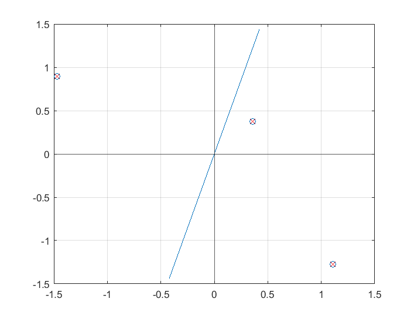

.. _chapter_components:

**********
Components
**********

What is a component
===================

Components
Decomposing signals in components (matrix factorization problems) A very general formulation of the problem can be stated as follows: What could be a function from an m dimensional space to an n dimensional space such that the transformed variables give information on the data that is otherwise hidden in the large data set. That is, the transformed variables should be the underlying factors or components that describe the essential structure of the data. It is hoped that thesecomponents correspond to some physical causes that were involved in the process that generated the data in the first place.

Ben Grossmann (https://math.stackexchange.com/users/81360/ben-grossmann), Is there a geometric meaning to the outer product of two vectors?, URL (version: 2020-04-23): https://math.stackexchange.com/q/965657

For any vector :math:`x`,

.. math:: uv^T(x)=(v{\dot}x)u
  
That is, If :math:`u` and :math:`v` are unit vectors, :math:`uv^T(x)` is the component of :math:`x` in the :math:`v` direction, taken into the :math:`u` direction.

QR decomposition
----------------
see find orthognal vectors

Principal Component Analysis
============================
Principal Component Analysis (PCA) is the corner stone of machine learning methods. 

.. code:: text

  >> data
  data =
     -2.2588    0.3188   -0.4336
      0.8622   -1.3077    0.3426

  >> X=data'-mean(data')
  X =
     -1.4676    0.8965
      1.1100   -1.2734
      0.3576    0.3769

  >> cov(X,1)
  ans =
      1.1713   -0.8648
     -0.8648    0.8558

  >> C=X'*X./3
  C =
      1.1713   -0.8648
     -0.8648    0.8558

  >> e
  e =
      0.2813
      0.9596

  >> e'*C*e
  ans =
      0.4138

  >> sum((X*e).^2)/3
  ans =
      0.4138
    
    
This is a real-data example to show that if we define this vector as :math:`\vec{v}`, then the projection of our data :math:`D` onto this vector is obtained as 
:math:`\vec{v}^{\intercal} D`, and the variance of the projected data is :math:`\vec{v}^{\intercal} \Sigma \vec{v}`.

|pca|

https://www.visiondummy.com/2014/04/geometric-interpretation-covariance-matrix/

  
