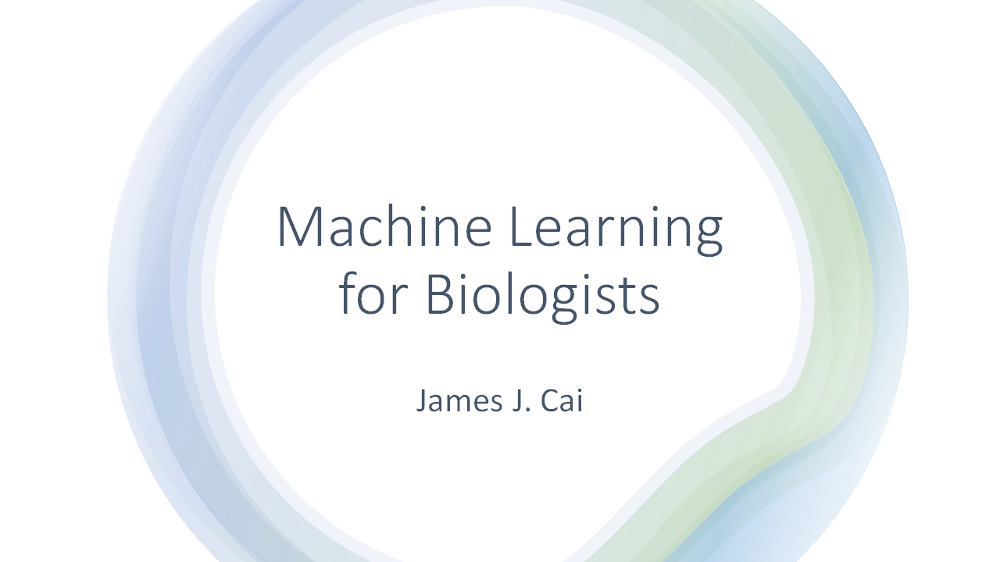
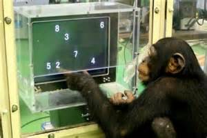

.. Machine Learning for Biologists documentation master file, created by
   sphinx-quickstart on Wed Jan  6 08:56:27 2021.
   You can adapt this file completely to your liking, but it should at least
   contain the root `toctree` directive.

Machine Learning for Biologists
===============================

|ml4btitled|

Introduction
------------
Data-driven discovery is revolutionizing the modeling, prediction, and control of complex systems. This textbook brings together machine learning, engineering mathematics, and mathematical physics to integrate modeling and control of dynamical systems with modern methods in data science. It highlights many of the recent advances in scientific computing that enable data-driven methods to be applied to a diverse range of complex systems, such as turbulence, the brain, climate, epidemiology, finance, robotics, and autonomy. Aimed at advanced undergraduate and beginning graduate students in the engineering and physical sciences, the text presents a range of topics and methods from introductory to state of the art.

Machine learning methods are taking a central role in modern bioinformatics and beyond. They can provide an efficient ….. Our goal is to explain machine learning methods and some associated methods as quickly and as painlessly as possible. Beginning with the key definitions, the ______ is presented through examples. We then provide an introduction to matrix product states. We conclude the tutorial with tensor contractions evaluating combinatorial counting problems. The first one counts the number of solutions for Boolean formulae, whereas the second is Penrose's tensor contraction algorithm, returning the number of 3-edge-colorings of 3-regular planar graphs.

Due to the number of gates and the similarities between them, this chapter is at risk of becoming a list. To counter this, we have included a few digressions to introduce important ideas at appropriate places throughout the chapter.

In this book, I provide a self-contained, succinct description of machine learning and of the basic algorithms with a focus on implementation. Since Matlab and Julia are now available as a high-performence computer languages, I present results from simulator and actual experiments for smaller input data sets. The code and implementations
accompanying the paper can be found at https://github.com/jamesjcai/ml4bio.

What is intelligence?
---------------------
Intelligence has been defined in many ways: the capacity for logic, understanding, self-awareness, learning, emotional knowledge, reasoning, planning, creativity, critical thinking, and problem-solving. More generally, it can be described as the ability to perceive or infer information, and to retain it as knowledge to be applied towards adaptive behaviors within an environment or context. https://en.wikipedia.org/wiki/Intelligence

|chimptest|

Chimpanzee test: This is a test of working memory, made famous by a study that found that chimpanzees consistently outperform humans on this task. In the study, the chimps consistently outperformed humans, and some chimps were able to remember 9 digits over 90% of the time.

https://www.youtube.com/watch?v=zsXP8qeFF6A

Exponential is worse than polynomial
------------------------------------
If you ask a biologist if he or she can write the exponential equation, he or she might find it difficult although many of them may use the concept of exponential growth in their daily working life. They may find it troubling to write as :math:`f(x)=c^x` or :math:`f(x)=x^c`, where :math:`c` is a constant. O(n^2) falls into the quadratic category, which is a type of polynomial (the special case of the exponent being equal to 2) and better than exponential. Exponential is much worse than polynomial. Look at how the functions grow.

.. code-block:: text

   n    = 10    |     100   |      1000
   n^2  = 100   |   10000   |   1000000 
   k^n  = k^10  |   k^100   |    k^1000

k^1000 is exceptionally huge unless k is smaller than something like 1.1. Like, something like every particle in the universe would have to do 100 billion billion billion operations per second for trillions of billions of billions of years to get that done.

.. toctree::
   :maxdepth: 2
   :caption: Chapters
  
   chapter_vectors
   chapter_matrices
   chapter_distances
   chapter_probability
   chapter_optimization
   chapter_components
   chapter_decomposition
   chapter_regression
   chapter_clustering
   chapter_classification
   chapter_graph
   chapter_manifold
   chapter_tensors
 
.. toctree::
   :maxdepth: 2  
   :caption: Appendices
  
   refs
   glos
   tutor1
   tutor2
 

Indices and tables
==================
 * :ref:`genindex`
 * :ref:`search`

